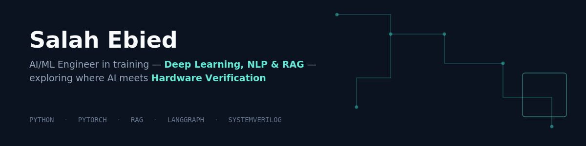

# Hi, I'm Salah Ebied 👋

**AI/ML Engineering student** at Helwan University, building deep learning and LLM-powered systems — now exploring the intersection of **AI and Digital IC Verification**.

- 🎯 Currently working on my graduation project: applying AI to hardware verification
- 🏆 1st Place Winner — Instant x Orange Digital Center Hackathon (Team Lead)
- 🌱 Deepening my skills in SystemVerilog, UVM, and verification methodologies
- 📫 Reach me: [LinkedIn](https://www.linkedin.com/in/salah-ebied-3138241b1/) · [YouTube](https://www.youtube.com/@salah-d8t)

---

## 🧠 Technical Skills

**AI / ML:** Python · PyTorch · TensorFlow · Scikit-Learn
**NLP / LLMs:** LangChain · Transformers · RAG · Prompt Engineering
**Hardware / Verification:** Verilog · SystemVerilog · UVM
**Tools:** Git · SQL

---

## 📌 Featured Projects

### 🏆 [Hakeem AI — Grounded Drug-Drug Interaction Assistant](https://github.com/engSalah-dot/Hakeem-AI-DDI-Assistant)
A safety-first medical assistant using hybrid RAG (dense + lexical + cross-encoder reranking) with hard grounding gates against hallucination — refuses to answer unless retrieved evidence explicitly supports it.
**1st Place**, Instant x Orange Digital Center Hackathon — built as Team Lead.
- Full-stack architecture: Next.js frontend, FastAPI backend
- JWT authentication with Argon2 password hashing
- Fernet-encrypted user health profiles
- Production deployment on Vercel with PostgreSQL + pgvector
- Automated test suite covering safety routing and grounding

`RAG` `ChromaDB` `FastAPI` `Next.js` `JWT/Argon2` `PostgreSQL/pgvector` `System Design`

### 🎓 [Gemini EduRAG](https://github.com/engSalah-dot/EduChat)
Multimodal educational assistant that answers grounded questions from user-uploaded PDFs and YouTube videos.
Built during NTI's NLP training track as AI/Technical lead for a 5-person team.
- Content ingestion pipeline for both PDFs and video transcripts
- Gemini as primary LLM with Groq as fallback generator
- Educational Podcast feature — converts learning material into audio via Gemini TTS

`RAG` `Gemini` `Groq` `ChromaDB` `Text-to-Speech` `NLP`

### 🗣️ [Arabic Aspect-Based Sentiment Analysis](https://github.com/engSalah-dot/Aspect-Based-Sentiment-Analysis-ABSA-)
Two-stage NLP pipeline (MARBERTv2) detecting aspects and sentiment in informal, mixed-language Arabic customer reviews. Built for DeepX Hackathon.
- Multi-label aspect detection + aspect-level sentiment classification
- **Micro F1 ~0.85** (aspect detection), **~90% accuracy** (sentiment classification)
- Interactive Streamlit demo

`NLP` `Transformers` `MARBERTv2` `Arabic NLP` `Streamlit`

### 🩺 [Chest X-Ray Pneumonia Classification](https://github.com/engSalah-dot/Deep-Learning-Projects)
CNN-based binary classifier detecting pneumonia from chest X-ray images, with Grad-CAM for model interpretability.
- Data preprocessing & augmentation pipeline
- Grad-CAM visualizations to explain model predictions
- 94% accuracy on the test set

`Deep Learning` `TensorFlow` `CNN` `Computer Vision` `Explainable AI`

### 🔧 [Transformer-Based LLM (From Scratch)](https://github.com/engSalah-dot/Transformer-LLM-From-Scratch)
Full Transformer architecture implemented from scratch in PyTorch — multi-head attention, positional encoding, and training loops — to understand what powers modern LLMs at the lowest level.

`PyTorch` `Transformers` `LLM`

---

## 📚 Additional Practice Projects

Earlier fundamentals-building exercises (classical ML, basic CNNs, and Python practice) are collected in my [**ML Learning Journey**](https://github.com/engSalah-dot/ML-Learning-Journey) repo.

---

## 🎓 Education

**Helwan University** — B.Sc. in Electronics & Communications Engineering
*Sep 2022 – Jun 2027* · GPA: 3.2 / 4.0
Relevant coursework: Machine Learning, Data Science, Computer Vision, Digital IC Design, Algorithms

---

## 🏆 Certifications

- Generative AI with Large Language Models — DeepLearning.AI
- Building LLM Apps — NVIDIA
- AI for All — NVIDIA
- Supervised Machine Learning: Regression and Classification — DeepLearning.AI, Stanford
- Unsupervised Machine Learning — DeepLearning.AI
- Machine Learning & AI Track — Sprints
- Intro to TensorFlow — Udacity
- Problem Solving — HackerRank

